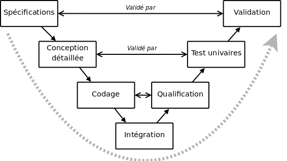
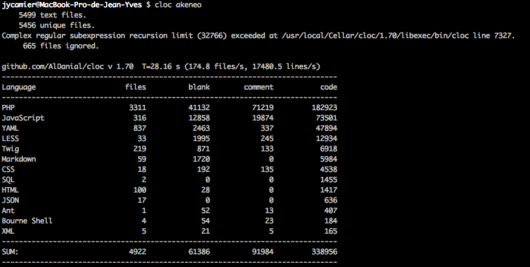

:title: Introduction à PhpUnit
:data-transition-duration: 1500
:css: tutorial.css

----

PhpUnit
=======

.. image:: images/ca.png

.. note::

    Bienvenue !

----

Jean-Yves CAMIER
================

- Travaille pour Clever Age
- Lead dev / Architecte Symfony 2
- DevOps
- Passion pour la qualité logiciel

.. note::

    C'est moi

----

Structure du cours
==================

- Une partie théorique et une partie pratique ;
- La partie théorique : **https://github.com/eheuje/phpunit-markdown-slide**
- La partie pratique : **https://github.com/eheuje/phpunit-markdown**

.. note::

    Todo

----

Qui a déjà testé son code ?
===========================

.. note::

    Poser la question ?

----

Sommaire
========

* Introduction à PHPUnit
* À propos de la qualité
* Tester
    * Tests manuels
    * Tests unitaires
    * Tests automatiques
* Définitions

.. note::

    ???

----

Introduction à PHPUnit
======================

.. note::

    ???

----

Le cycle de vie d’un projet
===========================

    Un cycle de vie de projet est l’ensemble des éléments constituant la vie d’un projet, de sa conception jusqu’à sa livraison final. Il existe un certain nombre de modèle de cycles de vie de projet et chacun de ces cycles à ses avantages et ses inconvénient.

    Il en existe un certain nombre et l’un des plus vieux étant le Cycle en V.

.. note::

    Nous ne sommes pas là pour voir l'ensemble des cycles de vie d'un projet et les différents modèles éxistant.
    Nous allons nous attardé sur la partie TestUnitaire visible sur le schéma.

----

.. note::

    Nous ne sommes pas là pour voir l'ensemble des cycles de vie d'un projet et les différents modèles éxistant.
    Nous allons nous attardé sur la partie TestUnitaire visible sur le schéma.
    test

----

PhpUnit - Définition
====================

    PhpUnit est une librairie de test unitaire créé en 2004 par Sebastian Bergmann. Elle fait partie de la suite d'outils de test *xUnit*, suite dans laquelle vous allez retrouver un grand nombre de similitude entre les outils. 

:
    En utilisant *JUnit* pour du Java, par exemple, vous retrouverez assez rapidement vos marques.

.. note::
    Est-ce que vous connaissez des frameworks xUnit ?
    Expliquer XUnit - JUnit et le norme d'appel et de sortie (par exemple XML pour l'intégration de rapport de tests)

----

Exemple de cas d'utilisation PhpUnit
====================================

.. code-block:: php

    <?
    class StackTest extends TestCase
    {
        public function testPushAndPop()
        {
            $stack = [];
            $this->assertEquals(0, count($stack));

            array_push($stack, 'foo');
            $this->assertEquals('foo', $stack[count($stack)-1]);
            $this->assertEquals(1, count($stack));

            $this->assertEquals('foo', array_pop($stack));
            $this->assertEquals(0, count($stack));
        }
    }
    ?>

.. note::

    Laissez les gens répondrent

----

Exemple de cas d'utilisation XUnit
==================================

.. code-block:: java

    import junit.framework.TestCase;

    public class JUnit3LimitsSample extends TestCase {
        String s;
        public void testNotNull() {
            s = null;
            assertNotNull(s);
        }
        public void testForMultipleEquals() {
            s = "xyzt";
            assertTrue(s.equals("abc") || s.equals("def") || s.equals("xyz"));
        }
    }
    

.. note::

    Laissez les gens répondrent

----

À propos de la qualité
======================

* Qu'est-ce que la qualité logiciel ?
* Pourquoi tester une application ?
* Quoi tester ?
* DIC ?

.. note::

    Qualité logiciel - maintenabilité, simplicité, découplage. Ce n'est pas parce qu'une application est testé qu'elle est de qualité.
    Tester une application, c'est une obligation : lorsque vous developpez, vous tester en local vos développement
    Quoi tester - developpement spécifique. Dans un framework, vous n'avez pas à tester les règles de fonctionnement des éléments constituant le framework : celui-ci est déjà testé par les développeurs du framework. Vous allez vous concentrer sur le métier. Voilà pourquoi mon premier exemple de PHPUNIT n'est pas un bon exemple. (montrer)
    Disponibilité - Intégrité - Confidentialité

-----

Les Tests
=========

* Les tests manuels
* Les tests unitaires
* Les tests automatiques
    
.. note::

    Nous allons voir trois façon de tester

----

Les tests manuels
=================

    Le test manuel, c'est celui que vous faites à chaque fois que vous developpez un bout de code et que vous affichez le résultat.

.. code-block:: php
    
    <?
    $test = '1';
    var_dump($test); // affiche string(1) "1"

    $test++;
    var_dump($test); // affiche int(2)

    kpr($test); // drupal inside
    ?>

.. note::

    Tester de cette façon est assez courrante. Nous l'avons tous fait et nous le faisons tous.
    Ce n'est toutefois pas la solution la plus performante.

----

Quels sont les limites de ce type de test ?
-------------------------------------------

.. note::

    Les limites - Vous pouvez tester comme ça si vous le souhaitez. Les développeurs faisant du Drupal utilise d'ailleurs une librairie qui ne fait que ça.

    Vous perdez du temps.
    Vous n'êtes pas à l'abris des regressions.
    Au début d'un projet, c'est possible de tester comme ça, mais lorsque vous avez atteind le million de ligne de code et que vous avez quelque chose comme 100 000 classes...

----

Pensez-vous qu'on puisse manuellement ce genre de projet ?
----------------------------------------------------------

    
.. note::

    Quels sont les limites de ce type de test ?

----

Les tests unitaire
==================

.. epigraph::

    Whenever you are tempted to type something into a print statement or a debugger expression, write it as a test instead.

    -- Martin Fowler

.. note::

    Nous avions vu une façon de tester de tester qui consiste à var_dumper ses variables.
    Martin Fowler est un spécialiste du génie logiciel, passionné par la qualité de code, le refatcoring, l'intégration continue...

----

Définition
==========

.. epigraph::

    Un test unitaire est une procédure permettant de vérifier le bon fonctionnement d'une partie précise d'un logiciel ou d'une portion d'un programme (appelée « unité » ou « module »).

    -- Wikipedia

C'est avec ce type de test que nous pouvons éviter en grande quantité de **regression**, au cours de la phase de développement.
Il est impératif de faire en sorte d'avoir des tests unitaires suffisement découplé entre eux. Si dans un test, vous tester le fonctionnement de l'intéraction de plusieurs entité de code entre elles,
vous êtes alors en train de faire des tests d'intégration.

.. note::

    ???

----

Exemple par la pratique
=======================

    `$ git clone https://github.com/eheuje/phpunit-markdown`

    `$ git checkout exemple_1`

.. note::

    syntaxe de class
    assertions
    phpunit.xml

----

Questions
=========

    * Que pouvez-vous dire de ces tests ?
    * Sont-ils pertinents ?
    * Sont-ils suffisants ?
    * Quels sont les limites de l'utilisation de la commande **phpunit** et les solutions ?

.. note::

    limites : temps d'execution important en cas de projet important,
    ne lance les tests qu'a la demande, oublie possible de lancer les tests

----

Faiblesses
==========

    La faiblesse d'outil de test comme PhpUnit reside en sa lourdeur:
        * n'est absoluement pas pertinent lorsque vous lancez l'ensemble de vos tests;
        * par extension, lent ;
        * lancement manuel pouvant rapidement être oublié (ou volontairement oublié).

.. note::

    limites : temps d'execution important en cas de projet important,
    ne lance les tests qu'a la demande, oublie possible de lancer les tests

----

Tests automatisés
=================

    Un test est considéré comme automatisé lorsque le lancement de ce test se fait automatiquement.
    Vous pouvez tout aussi bien lancer vos tests PhpUnit automatiquement, comme vous pouvez tout aussi bien lancer un test manuel automatiquement.

    Selon vous, quels sont les étapes d'un projet où il est pertinent de lancer des tests unitaires ?

.. note::

    Développement, intégration continue

----

Outils d'automatisation
=======================

    Les tests unitaires peuvent être lancés automatiquement pendant les phases suivantes:
        - **développement** : à l'aide d'un lanceur de tâche comme **grunt** ou **gulp** ;
        - **intégration** : à l'aide d'un serveur d'**intégration continue**, par exemple, et de tests d'intégrations ;

.. note::

    Grunt et pas Gulp ? Même chose que Php contre Java.
    Ces deux outils ont chacun des spécificités qui vont parfois s'avérer être plus intéressantes, fonction de votre besoin.

    Connaissez-vous l'intégration continue ?

----

Grunt
=====

    Grunt est un lanceur de tâche développé en Javascript et dépendant de **Node.js**.

    `$ git checkout exemple_1`

.. note::

    Connaissez-vous node.js ?

----

Définitions
===========

.. note::

    Je viens de parler d'intégration continue. Qui a déjà entendu parlé d'intégration continue ?

----

Définition - Test d'intégration
===============================

    Les tests d'intégration sont l'ensemble des tests vérifiants que les modules de code testés unitairement fonctionnent une fois ensemble.

.. note::

    Nous verrons les tests d'intégration par l'intermédiaire de l'exercice

----

Définition - Intégration Continue
=================================

    L'intégration continue est un concept qui consiste à intégrer continuellement et automatiquement tout développement sur un serveur d'intégration.
    Afin d'orchestrer cette automatisation, il existe des serveurs d'intégration continue permettant de configurer cette orchestration fonction de vos besoin.
    Il existe un certain nombre de serveur d'intégration continue, les plus connus étant **Jenkins**, **Travis CI** ou encore **Bamboo**.

.. note::

    Tests

----

Définition - Tests Fonctionnels
===============================

    Typologie de test orientée sur le fonctionnel de l'applicatif, c'est-à-dire la fonctionnalité finale attendu.
    Tester une fonctionnalité en développement, c'est se mettre dans la peau de l'utilisateur final.

Reprenons l'exemple de notre fichier **Math.php**:
    - lorsque vous testez une méthode de classe Math, vous tester unitairement votre code.
    - lorsque vous developpez une calculatrice en HTML / Javascript / PHP, à partir de la classe **Math** puis que vous testez la calculatrice, vous faites un test fonctionnel.

.. note::

    Rien à dire

----

Définition - Tests Techniques
=============================

    Typologie de test inverse des test fonctionnels.

Question:
    Pouvez-vous me citer quelque exemple de tests techniques ?

.. note::
    Test de monté en charge
    Test de pénétration

----

Définition - Scénario de tests
==============================

    Les scénario de tests sont l'ensemble des tests fonctionnels et techniques associés à une attente métier.

Exemples:
    * Scenario 1 - Saisie d'un login/mot de pass
    * Scenario 2 - Affichage du dashboard de backoffice

.. note::

    ???

----

Définition - Suites de tests
============================

    Une suite de tests, c'est un ensemble de Scénarios de test. C'est un vision plus macro

    * Suite 1 - Connexion d'un administrateur
        - Scenario 1 - Saisie d'un login/mot de pass
        - Scenario 2 - Affichage du dashboard de backoffice
    * Suite 2 - Connexion d'un utilisateur standard
        - Scenario 1 - Saisie d'un login/mot de pass
        - Scenario 2 - Affichage du dashboard de backoffice

.. note::

    ???

----

Définition - Assertions
=======================

    L’écriture de tests s’occupe de vérifier que le résultat test du test est bien égal à celui attendu.
    Il y a plusieurs méthodes d’assertion disponibles dans PHPUnit pour nous assister dans cette tâche.
    Quelques-unes des assertions les plus courantes sont listées ci-dessous.

.. code-block:: php

    <?
    // Check 1 === 1 is true
    $this->assertTrue(1 === 1);

    // Check 1 === 2 is false
    $this->assertFalse(1 === 2);

    // Check 'Hello' equals 'Hello'
    $this->assertEquals('Hello', 'Hello');

    // Check array has key 'language'
    $this->assertArrayHasKey('language', array('language' => 'php', 'size' => '1024'));

    // Check array contains value 'php'
    $this->assertContains('php', array('php', 'ruby', 'c++', 'JavaScript'));
    ?>

.. note::

    ???

----

Définition - Annotations
========================

    Les annotations sont des méta-données relatives à une classe, une méthode ou un attribut : elles apportent des informations /traitements complémentaires.
    Les annotations sont notemment un standard quand à la documentation PHP.

.. code-block:: php

    <?

    /**
     * Class MathTest
     *
     * @package Eheuje
     * @author  Jean-Yves Camier <jycamier@clever-age.com>
     */
    class MathTest extends TestCase
    {
        // Il y a du code ici
    }

    ?>

.. note::

    Savez-vous ce que c'est qu'une annotation ?
    Les annotations, on peut s'en servir pour les fixtures

----

Annotations (Attention)
=======================

Attention : les annotations ne sont pas native en PHP : seulement certaines librairies les utilisent::
    * **Doctrine** : il s'agit d'un ORM PHP que vous retrouvez nativement dans le framework **Symfony 2** ;
    * **Symfony 2** : pour le routing directement dans les controllers ;
    * **Zend Framework Server classes** : mapping XML-RPC, SOAP ;
    * **PhpUnit** : https://phpunit.de/manual/current/en/appendixes.annotations.html

https://phpunit.de/manual/current/en/appendixes.annotations.html

.. note::

    Savez-vous ce que c'est qu'une annotation ?

----

Annotations PhpUnit
===================

https://phpunit.de/manual/current/en/appendixes.annotations.html

.. note::

    Savez-vous ce que c'est qu'une annotation ?

----

Définition - Couverture du code
===============================

    La couverture de code (ou "code coverage" en anglais) est un indicateur qui permet de savoir le pourcentage de code testé aux travers de vos tests.

    `$ git checkout exemple_2`

.. note::

    ???

----

Définition - Fixtures
=====================

    Les fixtures sont utilisés pour injecter des donnes pour les tests.
    La bonne pratique est d'avoir un jeu de données qui couvrent les cas extrêmes et les cas nominaux.
    Un exemple de cas extrême pourrait être : indisponibilité d'un service, valeur nulle, valeur hors borne, etc.

    `$ git checkout exemple_3`

.. note::

    @dataProvider

----

Définition - Stubs & Mocks
==========================

    Lorsque que l'on souhaite tester un objet **A** utilisant un objet **B** pour certaines de ses méthodes, afin de ne pas
    influencer les résultats de ces tests par **B** un état non-désirer de **B**, on simule le comportement attendu de **B** par **A** par l'intermédiaire de ce
    que l'on appelle un Stubs/Mock (ou encore "Bouchon" en Français).

    `$ git checkout exemple_4`

.. note::

    Est-ce que tout le monde à compris ?

----

Définition - TDD
================

    TDD (Test-driven development) est une méthode de développement consistant à ecrire les tests avant d'écrire
    toute ligne de code.

Cette méthodologie a plusieurs avantages:
    * il est plus simple de déterminer les signatures des fonctions et la composition des objets ;
    * le refactoring se fait de façon naturel ;
    * il est beaucoup plus fastidieux de faire l'inverse, contrairement à ce que l'on pourrait penser.

.. note::

    Avez-vous déjà été en SSII ?
    Anecdote : j'ai déjà vu vendre un projet d'écriture de tests unitaires et de refactoring pour un projet terminé depuis des mois
    et effectué par une autre société. Imaginer la quantité de temps nécéssaire à la rétro-ingénierie d'un projet non-documenté dont
    il faut écrire les tests.

----

Définition - TDD
================

.. image:: images/tdd.png

.. note::

    Explication complète du schema.

----

Alternative - BDD
=================

    BDD (Behavior-driven development) est une variante moderne du TDD : c'est exactement le même principe.
    La seule distinction réside dans la façon de présenter la chose et les outils "associés au BDD".

En l'occurence::
    * **TDD** = xUnit ;
    * **BDD** = librairie de test issue de Gherkin

.. note::

    Expliquer Gherkin Ruby et Behat

----

Aller plus loins
================

Alternative
-----------

* **Atoum** - Framework de test unitaire très orienté TDD, avec watcher intégré (très pratique) ;
* **Behat** - Framework de test fonctionnel BDD intégrant Gherkin ;
* **PHPSPEC** - Petit frère de Behat, mais orienté test unitaire ;

Automatisation
--------------

* **Intégration continue**
* **Déploiement continue**
